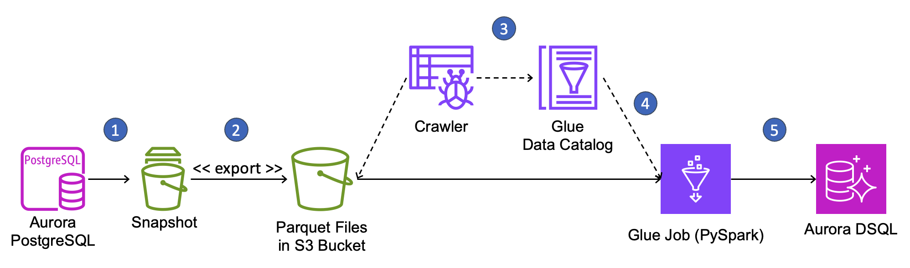

## Migrate data from an Amazon Aurora snapshot into Amazon Aurora DSQL

This project demonstrates how to use [AWS Glue](https://aws.amazon.com/glue/) to migrate data from an [Amazon Aurora](https://aws.amazon.com/rds/aurora/) database snapshot into an [Aurora DSQL](https://aws.amazon.com/rds/aurora/dsql/) cluster.

### Solution overview

AWS Glue is a data integration service that provides a managed parallel execution environment for Apache Spark jobs that perform Extract, Transform, Load (ETL) operations.  With Glue, you can write [PySpark](https://spark.apache.org/docs/latest/api/python/index.html) scripts that perform any data transformations their migration requires and they can run the scripts simply by specifying the number and capacity of compute nodes they would like to use for their migration.  The Glue service manages the underlying compute infrastructure and orchestrates the distribution and parallel execution of work across the compute nodes.

We’ll demonstrate this migration approach by moving a simple two-table database from Amazon Aurora PostgreSQL-Compatible Edition to Aurora DSQL using a database snapshot and AWS Glue. The following diagram shows the workflow for our migration. 



The migration workflow is as follows:

1.	Create a snapshot of your Aurora PostgreSQL cluster.
2.	Use the export-to-S3 feature of Aurora snapshots to extract data from the snapshot into an Amazon S3 bucket in Parquet format.
3.	Create and execute Glue crawlers to discover the Parquet files in S3, determine their schema, and record the schema and file locations in the Glue Data Catalog.  We'll create one crawler for each table in the source database.
4.	Create a PySpark ETL job in Glue that consults the Data Catalog to find and read files from S3, performs any required data transformations, and writes the data into Aurora DSQL.
5.	Run the ETL job to perform the one-time data load.

Note that Aurora DSQL only supports one database per cluster whereas Aurora clusters can host multiple databases.  To migrate an Aurora cluster that hosts multiple databases, you’ll need to repeat this migration process for each database contained in the Aurora snapshot, either deploying each database onto its own Aurora DSQL cluster or migrating multiple databases into individual schemas within one single database on Aurora DSQL.

### Data type conversions

The Aurora snapshot export-to-S3 process performs data conversions that will affect how data is eventually written into Aurora DSQL.  Some conversions may require correction or re-conversion, which can be performed in PySpark in the Glue ETL job.  For example, timestamp columns from the source database [will be converted to Parquet byte arrays](https://docs.aws.amazon.com/AmazonRDS/latest/AuroraUserGuide/aurora-export-snapshot.Considerations.html#aurora-export-snapshot.data-types.PostgreSQL) during snapshot export and will be interpreted as character string objects when read in PySpark.  These strings must be converted back to timestamp types before writing them to Aurora DSQL.  See the [export documentation](https://docs.aws.amazon.com/AmazonRDS/latest/UserGuide/USER_ExportSnapshot.data-types.html#USER_ExportSnapshot.data-types.PostgreSQL) to learn how the snapshot export process converts PostgreSQL data types into Parquet.

Aurora DSQL does not support all of the data types available in open-source PostgreSQL (see the [Aurora DSQL User Guide](https://docs.aws.amazon.com/aurora-dsql/latest/userguide/working-with-postgresql-compatibility-supported-data-types.html) for a list of all data types that Aurora DSQL does support).  You’ll need to identify which columns in your source database tables use a datatype that Aurora DSQL does not support, decide how you’ll represent them in Aurora DSQL, and perform the conversion in the Glue PySpark job.  Note that these columns may also undergo conversion during the snapshot export process, so your PySpark script will need to account for this.

### Handling primary keys

Many applications use serial integers for primary keys.  This makes it easy to automatically assign a unique identifier for new data and, in most relational databases, it places new rows close together in storage, making it more likely that recently-added rows will be placed in the buffer cache when other new, nearby rows are read.  New data tends to be read more often than old data in applications and reads from cache are much faster than reads from storage, so serial identifiers often produce improved read performance for many applications.

However, Aurora DSQL does not provide buffer caching and using serial integer keys at scale can create a hot storage partition as Aurora DSQL range partitioning places all new data on the same storage partition.  Instead, it’s better to choose a primary key that gives good distribution across range-partitioned storage.  Ideally, you could choose a compound key composed of a high cardinality column followed by one or more other columns where all of the columns already exist in your table.  This type of key is more likely to align with how you access your data, so it would not require additional secondary indexes. Also, it wouldn’t require additional data transformation during migration, since you would only be changing a table definition and not the data in the table.  

However, this isn’t always possible. Sometimes you must create a new primary key column to replace the old one, using either a universally unique identifier (UUID) or a randomized identifier.  Converting primary keys during migration is difficult and requires foreign key relationships to be corrected.  You may wish to retain the old identifiers in another column to map rows between the source database and the target database for verifying the migration.  All applications that interact with the database need to be updated to use the new identifiers.

We’ll convert primary keys to UUIDs and correct foreign key relationships in our example migration to demonstrate how this can be done using AWS Glue and PySpark.  We’ll retain the old primary keys in a separate column so we can map back to the source database.

### Migration steps

In this section, we walk through the process of migrating the database for a fictional retail application from Aurora PostgreSQL to Aurora DSQL.  Our goal in this article is to demonstrate the migration process with an example so that you may adapt it to your migration.

Our source database in Aurora PostgreSQL is called “storefront”.  Storefront contains the schema “sales” with the following tables:

```
CREATE SCHEMA sales;

CREATE TABLE sales.customers (
    id integer NOT NULL,
    username character varying(50),
    first_name character varying(50),
    last_name character varying(50)
);

CREATE TABLE sales.orders (
    id integer NOT NULL,
    customer_id integer,
    order_date date,
    order_timestamp timestamp without time zone,
    product_details jsonb,
    quantity integer,
    unit_cost numeric(6,2),
    unit_weight real
);

```

These tables aren't particularly effective for a real storefront database, but they contain columns with a variety of data types to demonstrate how they translate into Aurora DSQL.  Note that the `customer_id` column of the `sales.orders` table references the id column of the `sales.customers` table.  For the sake of simplicity, we haven't shown indexes and constraints above.

### Pre-requisites

The example migration should not be performed in a production environment.  To perform the example migration, you'll need an AWS account and sufficient privileges to create the resources, including IAM roles and permissions, for the migration.  As you adapt the example solution for your own migration, that work should be performed and thoroughly tested in a non-production account before migrating your production data.

You'll also need access to a Unix bash shell session running locally on your workstation or on a compute instance running in your AWS environment.  The workstation must have network access to the AWS account and the source and target databases and must have a recent version of the AWS Command-Line Interface (CLI) installed.  The CLI [must be configured](https://docs.aws.amazon.com/cli/latest/userguide/cli-chap-configure.html) with the IAM role mentioned above.

You should have an intermediate-level experience working with databases in the AWS environment, working with Unix shells, and working with the AWS console and AWS services like CloudFormation.  Based on this assumption, we do not provide specific instructions for setting up the source database, connecting to the databases, or setting up the workstation that you'll run commands on.

The migration requires an Amazon S3 bucket, Glue crawlers, a Glue job, an [AWS KMS](https://aws.amazon.com/kms/) key, and several IAM policies and roles that grant the permissions that enable the end-to-end workflow.  For the sake of convenience, these components are deployed using an [AWS CloudFormation](https://docs.aws.amazon.com/AWSCloudFormation/latest/UserGuide/Welcome.html) template that sets up the infrastructure and deploys the PySpark code used in the migration. The CloudFormation template and related files are available in a GitHub repo and must be downloaded to your workstation. Clone this project to your workstation.

The project contains the following files:

|  |  |
| --- | --- |
| **stack.yml** |	Creates the S3 bucket, KMS key, Glue crawler, Glue job, and related IAM policies and roles referenced below. |
| **ddl-dsql.sql** |	Contains SQL commands to create the require schema, tables, and indexes in the target Aurora DSQL cluster. |
| **storefront.sql.zip** |	Contains SQL commands to create the schema and tables for the source database and to populate the tables with sample data. |

[Create a new Aurora PostgreSQL cluster](https://docs.aws.amazon.com/AmazonRDS/latest/AuroraUserGuide/Aurora.CreateInstance.html) in a private sub-network in a VPC in your AWS account.  We used PostgreSQL 17.7 for the example migration.  Name the cluster "prod-cluster" and give it an **initial database name** of "storefront".  If you forget to set the initial database name on cluster creation, then login to the cluster and create the database by running the following SQL statement:

```
CREATE DATABASE storefront;
```

Create the database schema and load sample data from the bash shell by running the following commands in the project directory.

```
unzip storefront.sql.zip
psql -h <<your cluster's hostname>> -U postgres -f storefront.sql -d storefront
```

You'll be prompted to enter the password of your database cluster's "postgres" user.  After the data is loaded, log into the storefront database and view the sample data with the following SQL commands:

```
select * from sales.customers limit 20;
select * from sales.orders limit 20;
```

Now that the example's source database is ready, it's time to perform the data migration to Aurora DSQL.

### Performing the Migration

First, create an Aurora DSQL cluster.  Run the following commands at a Unix-like command-line to create a single-region Aurora DSQL cluster with the name "storefront" and save its endpoint and Amazon Resource Name (ARN) in new environment variables.  Cluster creation will only take several seconds.

```
export DSQL_CLUSTER_ID=($(aws dsql create-cluster --no-deletion-protection-enabled --tags Name=storefront --output text --query 'identifier'))

export DSQL_ENDPOINT=$(aws dsql get-cluster --identifier $DSQL_CLUSTER_ID --output text --query 'endpoint')

export DSQL_CLUSTER_ARN=$(aws dsql get-cluster --identifier $DSQL_CLUSTER_ID --output text --query 'arn')
```

Check the status of the cluster with the following command:

```
aws dsql get-cluster --identifier $DSQL_CLUSTER_ID --output text --query 'status'
```

Run the command a few times until the status is “ACTIVE”. When the Aurora DSQL cluster is active, [connect to the cluster](https://docs.aws.amazon.com/aurora-dsql/latest/userguide/SECTION_authentication-token.html#authentication-token-cloudshell) and create the schema and tables by running the commands in the ddl-dsql.sql file from the GitHub project.

Next you’ll create a new AWS CloudFormation stack named "apg-to-dsql" using the stack.yml template file from the GitHub project mentioned above.  The stack name is important because we'll reference it later. The stack requires the following parameters:

| | |
| --- | --- |
| **DSQLClusterEndpoint** | The endpoint of the Aurora DSQL cluster that you created above.  You can find this value in the cluster's details page in the AWS Console.|
| **DSQLClusterArn** | The ARN of the Aurora DSQL cluster that you created above.  You can find this value in the cluster's details page in the AWS Console.|
| **LoaderJobCapacity** |The maximum capacity in AWS Glue data processing units (DPUs) that can be allocated to the DSQL loader job, from 2 to 100.  A DPU is a relative measure of processing power that consists of 4 vCPUs of compute capacity and 16 GB of memory.  Choose a capacity in DPUs based on the size and complexity of your migration. |
| **ExportJobName** | A name for the snapshot export job.  This name must be unique in your account. |
| **SourceDatabaseName** | The name of the source database in Aurora PostgreSQL.|
| **SourceSchemaName**|The name of the schema to migrate from the source database.|

Run the following commands in the project directory to create the stack using default values for the sample migration.

```
aws cloudformation create-stack --stack-name apg-to-dsql --template-body file://stack.yml --capabilities CAPABILITY_NAMED_IAM --parameters ParameterKey=DSQLClusterEndpoint,ParameterValue=$DSQL_ENDPOINT ParameterKey=DSQLClusterArn,ParameterValue=$DSQL_CLUSTER_ARN 

aws cloudformation wait stack-create-complete --stack-name apg-to-dsql
```

Wait for the stack to complete. It will have several output values that are required in subsequent steps.

| | |
| --- | --- |
| **KmsKeyArn** |The ARN of the KMS key created to encrypt the exported snapshot data.|
| **SnapshotExportRoleArn** | The ARN of the IAM role that the snapshot export process needs to store data in S3. |
| **GlueRoleName** | The name of the IAM role that gives the Glue job the access it needs. |
| **GlueRoleArn** | The ARN of the IAM role that gives the Glue job the access it needs.|
| **GlueJobName** |The name of the Glue job.|

Run the following commands to fetch stack parameters and output values into environment variables for easy use in subsequent commands. Note that if you named your stack something other than "apg-to-dsql", you'll need to modify the commands to use the name you choose for the stack.

```
export EXPORT_JOB_NAME=$(aws cloudformation describe-stacks --stack-name apg-to-dsql --query 'Stacks[0].Parameters[?ParameterKey==`ExportJobName`].ParameterValue' --output text)

export BUCKET_NAME=$(aws cloudformation describe-stacks --stack-name apg-to-dsql --query 'Stacks[0].Outputs[?OutputKey==`BucketName`].OutputValue' --output text)

export DATABASE_NAME=$(aws cloudformation describe-stacks --stack-name apg-to-dsql --query 'Stacks[0].Parameters[?ParameterKey==`SourceDatabaseName`].ParameterValue' --output text)

export EXPORT_ROLE_ARN=$(aws cloudformation describe-stacks --stack-name apg-to-dsql --query 'Stacks[0].Outputs[?OutputKey==`SnapshotExportRoleArn`].OutputValue' --output text)

export KMS_KEY_ARN=$(aws cloudformation describe-stacks --stack-name apg-to-dsql --query 'Stacks[0].Outputs[?OutputKey==` KmsKeyArn`].OutputValue' --output text)

export GLUE_JOB_NAME=$(aws cloudformation describe-stacks --stack-name apg-to-dsql --query 'Stacks[0].Outputs[?OutputKey==`GlueJobName`].OutputValue' --output text)
```

Create the database snapshot with the following command.  Note that we are naming the snapshot "migrate-to-dsql" and our source database cluster is named "prod-cluster" as described above.  We capture the Amazon Resource Name (ARN) of the snapshot into an environment variable called `SNAPSHOT_ARN` for use later.

```
export SNAPSHOT_ARN=$(aws rds create-db-cluster-snapshot --db-cluster-snapshot-identifier migrate-to-dsql --db-cluster-identifier prod-cluster --output text --query 'DBClusterSnapshot.DBClusterSnapshotArn')
```

Check the status of the snapshot with the following command:

```
aws rds describe-db-cluster-snapshots --db-cluster-snapshot-identifier migrate-to-dsql --output text --query 'DBClusterSnapshots[*].Status'
```

Run the command a few times until the status is “available”, then export the snapshot with the following command:

```
aws rds start-export-task --export-task-identifier "$EXPORT_JOB_NAME" --source-arn $SNAPSHOT_ARN --s3-bucket-name "$BUCKET_NAME" --iam-role-arn "$EXPORT_ROLE_ARN" --kms-key-id "$KMS_KEY_ARN"
```

Run the following command periodically to get the status of the export job until the job status is "COMPLETE".

```
aws rds describe-export-tasks --export-task-identifier "$EXPORT_JOB_NAME" --query 'ExportTasks[0].Status' --output text
```

At this point, you’ve created all the infrastructure required for the migration, created a snapshot of the source database, and exported the snapshot into an S3 bucket as Parquet files.  Next, you’ll run the Glue crawlers to catalog the exported data and run the PySpark job to load the data into Aurora DSQL.

Run the Glue crawlers for both exported tables from the source database with the commands below.  The crawlers were created in the CloudFormation template. 

```
aws glue start-crawler --name customers
aws glue start-crawler --name orders
```

Run the following commands to get the states of the crawler jobs.  It may take several minutes for the crawlers to run to completion, depending on the amount of data to crawl.  Run the commands every minute or so until both jobs show a status of "COMPLETED".

```
aws glue list-crawls --crawler-name customers --output text --query 'Crawls[0].State'

aws glue list-crawls --crawler-name orders --output text --query 'Crawls[0].State'
```

When both crawler jobs have completed, run the following command to see the tables and columns that the crawlers cataloged from the exported snapshot data.  The catalog will be used by the Glue loader job to find the exported snapshot data in the S3 bucket.

```
aws glue get-tables --database-name "$DATABASE_NAME" --query 'TableList[*].[Name,StorageDescriptor.Columns[*]]'
```

The output should look like this:

```
[
    [
        "sales_customers",
        [
            {
                "Name": "id",
                "Type": "int"
            },
            {
                "Name": "username",
                "Type": "string"
            },
            {
                "Name": "first_name",
                "Type": "string"
            },
            {
                "Name": "last_name",
                "Type": "string"
            }
        ]
    ],
    [
        "sales_orders",
        [
            {
                "Name": "id",
                "Type": "int"
            },
            {
                "Name": "customer_id",
                "Type": "int"
            },
            {
                "Name": "order_date",
                "Type": "string"
            },
            {
                "Name": "order_timestamp",
                "Type": "string"
            },
            {
                "Name": "product_details",
                "Type": "string"
            },
            {
                "Name": "quantity",
                "Type": "int"
            },
            {
                "Name": "unit_cost",
                "Type": "string"
            },
            {
                "Name": "unit_weight",
                "Type": "float"
            }
        ]
    ]
]
```

Run the Glue job by running the following command:

```
export JOB_RUN_ID=($(aws glue start-job-run --job-name "$GLUE_JOB_NAME" --output text --query 'JobRunId'))
```

Run the command below to get the job's status.  Run it periodically until the job completes.

```
aws glue get-job-run --job-name "$GLUE_JOB_NAME" --run-id $JOB_RUN_ID --output text --query 'JobRun.JobRunState'
```

When the job completes, the data migration is done.

### Verification

We'll perform simple row counts and sum numeric columns to verify that our migration is complete and correct.

First, run the following queries in both the source Aurora PostgreSQL database and the target Aurora DSQL cluster:

```
select count(*) from sales.customers;
```

Both counts should be equal.  Now run the following query in both the source Aurora PostgreSQL database and the target Aurora DSQL cluster and verify that all of the counts and sums are the same:

```
select count(*), sum(quantity), sum(unit_cost) from sales.orders;
```

This simplistic approach to verifying the migration will not be sufficient for production migrations.  Instead, a row-by-row comparison of every column value may be required, taking into consideration any transformations performed during the migration.

### Clean-Up

Now that you've run the migration and verified the results, it's time to clean-up the resources created in this sample.  

First, delete the CloudFormation stack by running the following command:

```
aws cloudformation delete-stack --stack-name apg-to-dsql
```

Run the following command every so often to get the state of the stack until the command returns the error "Stack with id apg-to-dsql does not exist".  This will indicate that the stack has been deleted.

```
aws cloudformation describe-stacks --stack-name apg-to-dsql --output text --query 'Stacks[*].StackStatus'
```

When the CloudFormation stack has been deleted, delete the Aurora DSQL cluster by running the following command:

```
aws dsql delete-cluster --identifier $DSQL_CLUSTER_ID
```

Finally, delete the database snapshot by running the following commands.

```
aws rds delete-db-cluster-snapshot --db-cluster-snapshot-identifier migrate-to-dsql
```

Finally, [delete the Aurora PostgreSQL cluster](https://docs.aws.amazon.com/AmazonRDS/latest/AuroraUserGuide/USER_DeleteCluster.html) that served as the source database in this example.


## Security

See [CONTRIBUTING](CONTRIBUTING.md#security-issue-notifications) for more information.

## License

This library is licensed under the MIT-0 License. See the LICENSE file.

